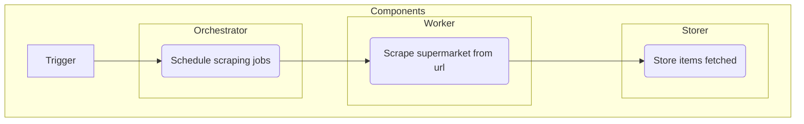

# GrocerEasy

Automatic grocery optimizing cost and quality.
It currently supports only Swiss Supermarkets (Migros, Coop, Lidl).

## Requirements

The project requires a GCP project to be run. 

```bash
    export GCP_PROJECT_ID=<GCP_PROJECT_ID>
    export GCE_INSTANCE_ZONE=<GCE_INSTANCE_ZONE>
```

Make sure you also create or can access the secrets in the repository (`GCE_SA_KEY`, `TESTER`, `GCE_INSTANCE_ZONE`, `GCE_INSTANCE_ZONE`). 

It can be either run locally (development infrastructure) or via the VMs provided (production infrastructure).
Make sure you have the correct permissions locally in the GCP project.

### Infrastructure
Infrastructure is handled thorugh terraform.

To build the infrastructure initilize and apply the changes in the `infrastructure` folder.

- production: to build the production infrastructure, run
```bash
    cd ./infrastructure/
    cd ./base terraform init; cd ..
    cd ./development terraform init; terraform apply
```

- production: to build the production infrastructure, run
```bash
    cd ./infrastructure/
    cd ./base terraform init; cd ..
    cd ./production terraform init; terraform apply
```

Note: to make changes to the infrastructure you must have the correct permissions.

## Technical design

### Dataset
The dataset is populated via the Swiss supermarket websites. 
It is a long running job and to make it resilient the following structure is used.



### Automated grocery
To automate your grocery for the products <item_1> ... <item_n> run 

```bash
    python project/main.py -p <item_1> ... <item_n> -w <weight_of_cost> -l <language>
```

The grocery is optimized based on the cost and the popularity of the products. 
To give more weight to the cost or the popularity make sure to change the `<weight_of_cost>` parameter. 

NOTE: Please make sure the items are in the specified language.

