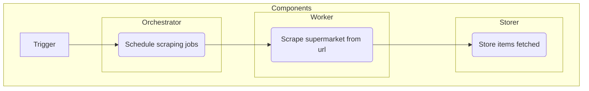

# GrocerEasy

GrocerEasy is an automated grocery optimizer that helps save money while also ensuring high-quality products. The tool is currently only compatible with Swiss supermarkets such as Migros, Coop, and Lidl.

## Requirements

In order to run GrocerEasy, you will need a Google Cloud Platform (GCP) project. Set the following environment variables:

```bash
    export GCP_PROJECT_ID=<GCP_PROJECT_ID>
    export GCE_INSTANCE_ZONE=<GCE_INSTANCE_ZONE>
```

You will also need to create or have access to the secrets in the repository (GCE_SA_KEY, TESTER, GCE_INSTANCE_ZONE, GCE_INSTANCE_ZONE). The tool can be run locally (development infrastructure) or via the VMs provided (production infrastructure). Make sure you have the correct permissions locally in the GCP project.

## Infrastructure

Infrastructure for GrocerEasy is handled through Terraform. To build the infrastructure, initialize and apply the changes in the infrastructure folder. Follow the instructions below for either production or development:

- development: to build the dev infrastructure, run
```bash
    cd ./infrastructure/
    cd ./base terraform init; cd ..
    cd ./development terraform init; terraform apply
```

- production: to build the production infrastructure, run
```bash
    cd ./infrastructure/
    cd ./base terraform init; cd ..
    cd ./production terraform init; terraform apply
```
Note: to make changes to the infrastructure you must have the correct permissions.

## Technical design

### Dataset

The dataset for GrocerEasy is populated via the Swiss supermarket websites. To make this process resilient, the following structure is used:


### Automated grocery

To automate your grocery for the products <item_1> ... <item_n>, run the following command:

```bash
    python project/main.py -p <item_1> ... <item_n> -w <weight_of_cost> -l <language>
```

The grocery is optimized based on the cost and the popularity of the products. To give more weight to the cost or the popularity, change the <weight_of_cost> parameter. Please ensure that the items are in the specified language.